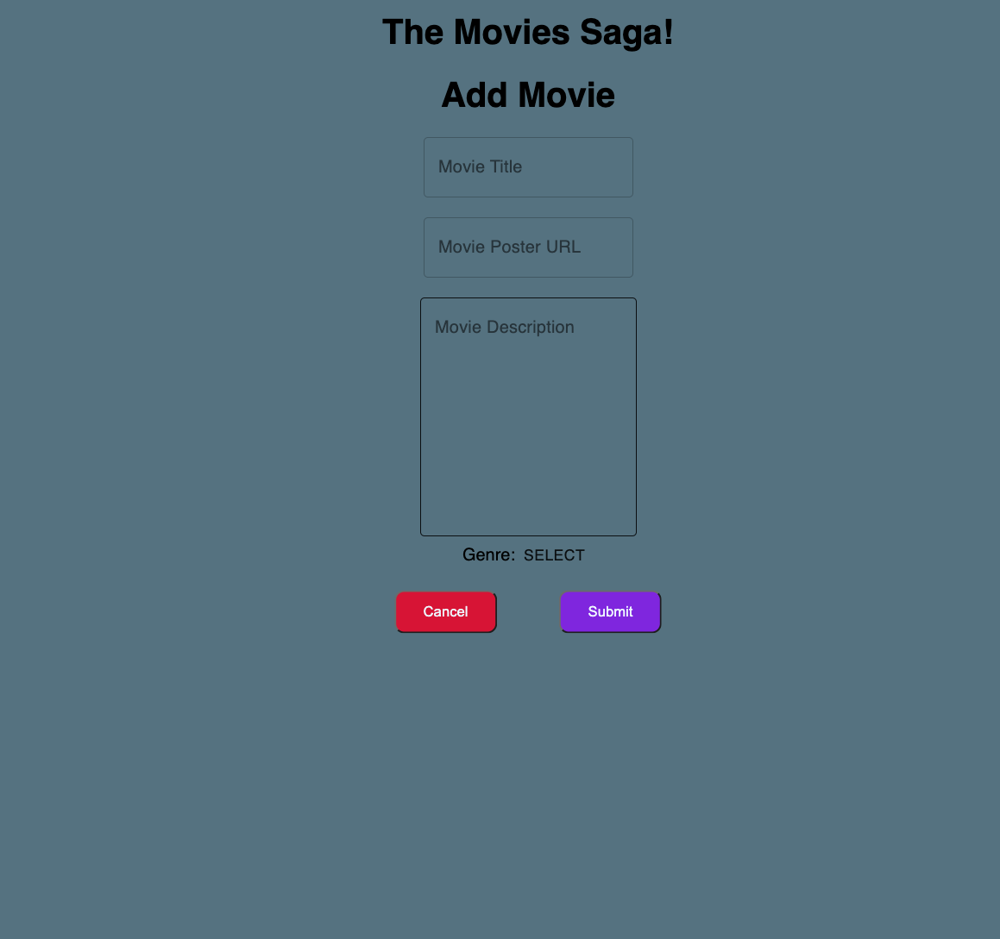

# Movie App

## Description

This to-do list is my first attempt at creating a functional and attractive full-stack app from scratch.

### Prerequisites

- [React.js](https://reactjs.org/)
- [Redux.js](https://redux.js.org/)
- [Material-UI](https://material-ui.com/)
- [Node.js](https://nodejs.org/en/)
- [Postgres](https://www.postgresql.org/download/)
- [Postico](https://eggerapps.at/postico/)
- [Redux-Saga]

## Installation

1. Create a SQL database named `saga_movies_weekend`
2. The queries in the `database.sql` file are set up to create all the necessary tables. The INSERT statement will populate the table with dummy data if you'd like to see how the Movie App looks with data already inserted. The project is built on [Postgres](https://www.postgresql.org/download/), so you will need to make sure to have that installed. I recommend using Postico to run those queries as that was used to create the queries.
3. Open up your editor of choice and run an `npm install` in the terminal
4. Run `npm run server`
5. Run `npm run client` and visit localhost:3000 in your browser

## Usage

- Brows the list of movies displayed on the page and click any of them to get more info about the movie.
- Adding a movie can be done by clicking the 'Add Movie' button at the top and filling out the required information, then clicking Submit. Clicking the 'Cancel' button will bring you back to the list page and no movie will be added.

## Built With

Node.js, Express, React, SQL, Redux, Redux-Saga and Material-UI.

## Acknowledgement
Thanks to [Prime Digital Academy](www.primeacademy.io) and all my class mates. I wouldn't know nearly as much as I do today without them. 

## Support
If you have suggestions or issues, please email me at cemerfoll@gmail.com